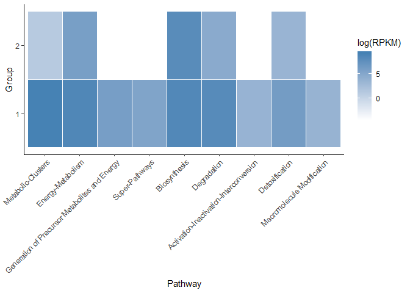
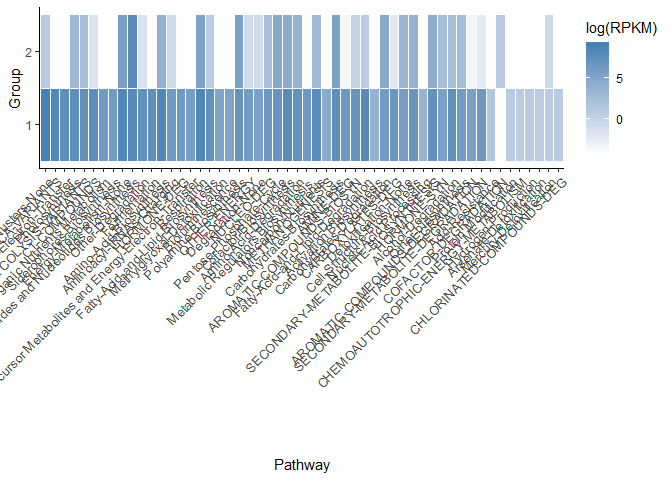
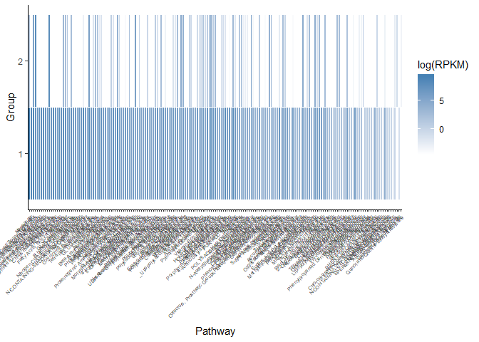

Data set exploration
================
Javier Castillo-Arnemann
October 12, 2018

Exploratory data analysis
-------------------------

``` r
suppressPackageStartupMessages(library(tidyverse))
library(cowplot)
```

    ## 
    ## Attaching package: 'cowplot'

    ## The following object is masked from 'package:ggplot2':
    ## 
    ##     ggsave

``` r
dataset <- read.table("data/df_MASTERTABLE.txt", sep = "\t", header = TRUE)


#Order depth factor for plotting
dataset$DEPTH <- factor(dataset$DEPTH, levels = c("MULTI","MES","DCM","MIX", "SRF"))

n_distinct(dataset$SAMPLE) #total number of samples
```

    ## [1] 299

``` r
#Depth vs region
dataset %>%
  ggplot(aes(GEOREGION, as.integer(DEPTHM))) +
  geom_point() +
  theme(axis.text.x = element_text(angle = 90, hjust = 1)) +
  scale_y_reverse()
```


``` r
#Combine LAT LON
dataset$LOC <- paste(dataset$LAT, dataset$LONG, sep = ", ")

#Find how many samples are in every location
dataset %>% 
  group_by(LOC) %>%
  summarize(samples_per_loc = n_distinct(SAMPLE))
```

    ## # A tibble: 143 x 2
    ##    LOC                 samples_per_loc
    ##    <chr>                         <int>
    ##  1 -0.6625, 73.161                   1
    ##  2 -1.8902, -84.6141                 1
    ##  3 -1.9002, -84.6265                 1
    ##  4 -12.9723, -96.0122                2
    ##  5 -12.9794, -96.0232                2
    ##  6 -13.0023, -95.9759                2
    ##  7 -15.3379, 43.2948                 2
    ##  8 -15.3424, 43.2965                 2
    ##  9 -16.9486, -100.6715               2
    ## 10 -16.9534, 53.9601                 2
    ## # ... with 133 more rows

``` r
#Play around with one sample
cenf <- filter(dataset, SAMPLE == "cenf")

#Check OMZ depths
depths <- filter(dataset, DEPTH_OMZ == "OMZ") %>% select(DEPTHM, DEPTH_OMZ, DEPTH)

#Depth heatmap
dataset %>%
    filter(DEPTH_OMZ != "MULTI") %>%
    ggplot(aes(LEVEL1, DEPTH)) + 
       geom_tile(aes(fill = log(RPKM)), 
                 colour = "white") + 
        scale_fill_gradient(low = "white",
        high = "darkblue") +
        theme(axis.text.x = element_text(angle = 45, hjust = 1)) +
        labs(x = "Pathway type",
             y = "Ocean Layer")
```


``` r
dataset %>%
    filter(DEPTH_OMZ != "MULTI") %>%
    ggplot(aes(LEVEL2, DEPTH)) + 
       geom_tile(aes(fill = log(RPKM)), 
                 colour = "white") + 
        scale_fill_gradient(low = "white",
        high = "darkblue") +
        theme(axis.text.x = element_text(angle = 45, hjust = 1))
```


``` r
#Comparing pathways in different samples
sample1 <- dataset %>%
    filter(SAMPLE == "cenf") %>%
    mutate(sample_id = as.factor(1))

sample2 <- dataset %>%
    filter(SAMPLE == "ERR599337") %>%
    mutate(sample_id = as.factor(2))

samples <- rbind(sample1, sample2) %>%
    filter(RPKM != 0) %>%
    arrange(RPKM)

#Common pathways
intersect(sample1$PWY_NAME, sample2$PWY_NAME)
```

    ##   [1] "PWY-4921"                          
    ##   [2] "PWY-6943"                          
    ##   [3] "PWY-82"                            
    ##   [4] "PWY-7214"                          
    ##   [5] "PWY-5461"                          
    ##   [6] "P641-PWY"                          
    ##   [7] "PWY-7299"                          
    ##   [8] "PWY-7097"                          
    ##   [9] "PWY-1001"                          
    ##  [10] "PWY-7445"                          
    ##  [11] "PWY0-1338"                         
    ##  [12] "PWY-6839"                          
    ##  [13] "LCYSDEG-PWY"                       
    ##  [14] "PWY-6756"                          
    ##  [15] "PWY-2361"                          
    ##  [16] "IDNCAT-PWY"                        
    ##  [17] "PWY-7307"                          
    ##  [18] "CRNFORCAT-PWY"                     
    ##  [19] "PWY-6837"                          
    ##  [20] "BSUBPOLYAMSYN-PWY"                 
    ##  [21] "PWY66-378"                         
    ##  [22] "PWY-5905"                          
    ##  [23] "PWY-6461"                          
    ##  [24] "SALVPURINE2-PWY"                   
    ##  [25] "PWY-7536"                          
    ##  [26] "PWY-6139"                          
    ##  [27] "PWY-31"                            
    ##  [28] "PWY-5886"                          
    ##  [29] "OXIDATIVEPENT-PWY"                 
    ##  [30] "PROTOCATECHUATE-ORTHO-CLEAVAGE-PWY"
    ##  [31] "PWY-5837"                          
    ##  [32] "PWY-7183"                          
    ##  [33] "PWY-7180"                          
    ##  [34] "PWY0-981"                          
    ##  [35] "PWY-7346"                          
    ##  [36] "ENTNER-DOUDOROFF-PWY"              
    ##  [37] "PWY-7292"                          
    ##  [38] "PWY-5138"                          
    ##  [39] "PWY-5162"                          
    ##  [40] "PWY-7179"                          
    ##  [41] "PWY-5148"                          
    ##  [42] "PWY-6333"                          
    ##  [43] "PWY-7344"                          
    ##  [44] "PWY-7417"                          
    ##  [45] "THREONINE-DEG2-PWY"                
    ##  [46] "MANNCAT-PWY"                       
    ##  [47] "PWY-6620"                          
    ##  [48] "PWY-6932"                          
    ##  [49] "ASPARAGINE-BIOSYNTHESIS"           
    ##  [50] "PROUT-PWY"                         
    ##  [51] "PWY-6543"                          
    ##  [52] "PWY0-1241"                         
    ##  [53] "PWY-7308"                          
    ##  [54] "HISDEG-PWY"                        
    ##  [55] "PWY-6700"                          
    ##  [56] "PWY-7338"                          
    ##  [57] "PWY-7337"                          
    ##  [58] "PWY-7250"                          
    ##  [59] "PWY0-1479"                         
    ##  [60] "CITRULLINE-DEG-PWY"                
    ##  [61] "PWY-6703"                          
    ##  [62] "PWY-6453"                          
    ##  [63] "PWY-6737"                          
    ##  [64] "PWY-6609"                          
    ##  [65] "ASPARTATESYN-PWY"                  
    ##  [66] "ASPARTATE-DEG1-PWY"                
    ##  [67] "THIOREDOX-PWY"                     
    ##  [68] "PWY-66"                            
    ##  [69] "PWY0-662"                          
    ##  [70] "SAM-PWY"                           
    ##  [71] "PWY-5340"                          
    ##  [72] "PWY-6708"                          
    ##  [73] "HOMOSER-THRESYN-PWY"               
    ##  [74] "PWY-6614"                          
    ##  [75] "PWY0-1021"                         
    ##  [76] "PWY-7206"                          
    ##  [77] "PWY-5078"                          
    ##  [78] "PWY-5669"                          
    ##  [79] "PWY-5046"                          
    ##  [80] "PWY-735"                           
    ##  [81] "FASYN-ELONG-PWY"                   
    ##  [82] "PWY-5137"                          
    ##  [83] "PWY-7291"                          
    ##  [84] "DETOX1-PWY"                        
    ##  [85] "PWY-7205"                          
    ##  [86] "PWY-5384"                          
    ##  [87] "PWY-5514"                          
    ##  [88] "PWY-6613"                          
    ##  [89] "PWY0-1319"                         
    ##  [90] "PHESYN"                            
    ##  [91] "PWY490-4"                          
    ##  [92] "CYSTSYN-PWY"                       
    ##  [93] "PANTO-PWY"                         
    ##  [94] "PWY-6936"                          
    ##  [95] "PWY-6307"                          
    ##  [96] "PWY-0"                             
    ##  [97] "TYRFUMCAT-PWY"                     
    ##  [98] "PWY-7197"                          
    ##  [99] "PWY-6164"                          
    ## [100] "MALATE-ASPARTATE-SHUTTLE-PWY"      
    ## [101] "PWY-6147"                          
    ## [102] "NAGLIPASYN-PWY"                    
    ## [103] "DTDPRHAMSYN-PWY"                   
    ## [104] "PWY-6788"                          
    ## [105] "PWY-7199"                          
    ## [106] "PWY-1722"                          
    ## [107] "PWY66-368"                         
    ## [108] "PPGPPMET-PWY"                      
    ## [109] "PWY-5659"                          
    ## [110] "PWY-5344"                          
    ## [111] "PWY-5921"                          
    ## [112] "PWY-6000"                          
    ## [113] "PWY66-367"                         
    ## [114] "PWY-7112"                          
    ## [115] "PWY-7269"                          
    ## [116] "PWY-5084"                          
    ## [117] "PWY-7533"                          
    ## [118] "PWY-2161"                          
    ## [119] "PWY-5143"                          
    ## [120] "NADPHOS-DEPHOS-PWY"                
    ## [121] "PWY0-1264"                         
    ## [122] "HOMOSERSYN-PWY"                    
    ## [123] "PWY-5041"                          
    ## [124] "PWY-6733"                          
    ## [125] "PWY-7176"                          
    ## [126] "PWY-5188"                          
    ## [127] "PWY66-21"                          
    ## [128] "GLYCLEAV-PWY"                      
    ## [129] "PWY-5989"                          
    ## [130] "PWY-7221"                          
    ## [131] "PWY-7220"                          
    ## [132] "PWY-7222"                          
    ## [133] "TRPSYN-PWY"                        
    ## [134] "PWY-5971"                          
    ## [135] "PWY-7187"                          
    ## [136] "1CMET2-PWY"                        
    ## [137] "PWY-6124"                          
    ## [138] "PWY-7198"                          
    ## [139] "VALSYN-PWY"                        
    ## [140] "PWY-7210"                          
    ## [141] "PWY66-387"                         
    ## [142] "HISTSYN-PWY"                       
    ## [143] "GLYOXYLATE-BYPASS"                 
    ## [144] "PWY-6122"                          
    ## [145] "PWY-6121"                          
    ## [146] "PWY-6545"                          
    ## [147] "PWY-7184"                          
    ## [148] "PWY-5686"                          
    ## [149] "PWY-5723"                          
    ## [150] "CALVIN-PWY"                        
    ## [151] "PWY-7219"                          
    ## [152] "PWY-3781"                          
    ## [153] "FAO-PWY"                           
    ## [154] "TRNA-CHARGING-PWY"

``` r
#Common pathways level2
intersect(sample1$LEVEL2, sample2$LEVEL2)
```

    ##  [1] "SECONDARY-METABOLITE-BIOSYNTHESIS"       
    ##  [2] "Noncarbon-Nutrients"                     
    ##  [3] "AROMATIC-COMPOUNDS-DEGRADATION"          
    ##  [4] "Nucleosides and Nucleotides Biosynthesis"
    ##  [5] "AMINE-DEG"                               
    ##  [6] "SECONDARY-METABOLITE-DEGRADATION"        
    ##  [7] "CARBOXYLATES-DEG"                        
    ##  [8] "Detoxification-None"                     
    ##  [9] "Other-biosynthesis"                      
    ## [10] "Alcohol-Degradation"                     
    ## [11] "Polyamine-Biosynthesis"                  
    ## [12] "HORMONE-SYN"                             
    ## [13] "Cofactor-Biosynthesis"                   
    ## [14] "Amino-Acid-Biosynthesis"                 
    ## [15] "HORMONE-DEG"                             
    ## [16] "Carbohydrates-Biosynthesis"              
    ## [17] "Cell-Structure-Biosynthesis"             
    ## [18] "Carbohydrates-Degradation"               
    ## [19] "AROMATIC-COMPOUNDS-BIOSYN"               
    ## [20] "Mercury-Detoxification"                  
    ## [21] "Amino-Acid-Degradation"                  
    ## [22] "Fatty-Acid-and-Lipid-Biosynthesis"       
    ## [23] "C1-COMPOUNDS"                            
    ## [24] "NUCLEO-DEG"                              
    ## [25] "Energy-Metabolism-None"                  
    ## [26] "Metabolic Regulators Biosynthesis "      
    ## [27] "Other-Degradation"                       
    ## [28] "Fatty-Acid-and-Lipid-Degradation"        
    ## [29] "Photosynthesis"                          
    ## [30] "Pentose-Phosphate-Cycle"                 
    ## [31] "OTHER-ENERGY"                            
    ## [32] "Degradation-None"                        
    ## [33] "Respiration"                             
    ## [34] "Aminoacyl-tRNAs-Charging"                
    ## [35] "GLYCOLYSIS-VARIANTS"                     
    ## [36] "Metabolic-Clusters-None"

``` r
#common pathways level1 
intersect(sample1$LEVEL1, sample2$LEVEL1)
```

    ## [1] "Biosynthesis"       "Energy-Metabolism"  "Degradation"       
    ## [4] "Detoxification"     "Metabolic-Clusters"

``` r
#plot pathway comparison
theme_set(theme_cowplot(font_size=12)) # reduce default font size

level1_p <- samples %>%
    ggplot(aes(fct_reorder(LEVEL1, RPKM, .desc = TRUE), as.character(sample_id))) + 
       geom_tile(aes(fill = log(RPKM)), colour = "white") + 
       scale_fill_gradient(low = "white", high = "steelblue") +
       labs(x = "Pathway", y = "Group") +
       theme_classic() +
       theme(axis.text.x = element_text(angle = 45, hjust = 1))

level2_p <- samples %>%
    ggplot(aes(fct_reorder(LEVEL2, RPKM, .desc = TRUE), as.character(sample_id))) + 
       geom_tile(aes(fill = log(RPKM)), colour = "white") + 
       scale_fill_gradient(low = "white", high = "steelblue") +
       labs(x = "Pathway", y = "Group") +
       theme_classic() +
       theme(axis.text.x = element_text(angle = 45, hjust = 1, size = 10)) 

level3_p <- samples %>%
    ggplot(aes(fct_reorder(LEVEL3, RPKM, .desc = TRUE), as.character(sample_id))) + 
       geom_tile(aes(fill = log(RPKM)), colour = "white") + 
       scale_fill_gradient(low = "white", high = "steelblue") +
       labs(x = "Pathway", y = "Group") +
       theme_classic() +
       theme(axis.text.x = element_text(angle = 45, hjust = 1, size = 5)) 

level1_p
```



``` r
level2_p
```



``` r
level3_p
```


